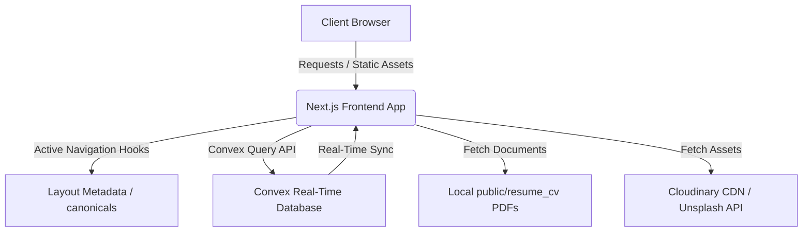

<div align="center">


# ✦ T A N M A Y . D E V ✦
### Architecting Intelligence. Dominating Complexity.

<p align="center">
  <a href="https://tanmaymirgal.dev/"><b>View Live Experience ↗</b></a> •
  <a href="#-features"><b>Key Features</b></a> •
  <a href="#-architecture"><b>Architecture</b></a> •
  <a href="#-technical-arsenal"><b>Tech Stack</b></a> •
  <a href="#%EF%B8%8F-local-setup"><b>Local Setup</b></a>
</p>

[](https://nextjs.org/)
[](https://www.typescriptlang.org/)
[](https://tailwindcss.com/)
[](https://convex.dev/)
[](https://www.framer.com/motion/)

*An elite, dark-themed, and highly interactive digital portfolio engineered for high-performance viewing and recruiters.*

</div>

---

### 🚀 Overview
**tanmay.dev** is a high-performance, minimalist digital portfolio designed to project a premium systems engineering vibe. Spacing, typography, and motion are meticulously orchestrated to showcase technical capabilities as a Full-Stack & AI/ML Engineer.

---

## ⚡ Features

### 1. 🌑 Premium Dark Editorial Theme
*   Fully custom, HSL-tailored dark color palette (`#0B0B0C`, `#0E0E10`, `#151518`) with high-contrast elements.
*   Elegant typography pairing: **Outfit** for structural headings and **JetBrains Mono** for technical/monospaced accents.
*   Glassmorphism overlays, subtle border illuminates, and hardware-accelerated transitions.

### 2. 🃏 Interactive 3D Milestones Card Deck
*   A dynamic, swipable stack of 10 real certificates, hackathon medals, publications, and internship completion cards.
*   Features a fluid click interaction: clicking the top card triggers a translation swipe-out (`translateX(150%) rotate(15deg)`) and cycles it to the back.
*   Monospaced progress tracker (`[ 01 / 10 ]`) and micro-interaction glows.

### 3. 🛹 Sticky Parallax Project Stack
*   Project items are styled as premium border-illuminated cards that stack vertically on scroll.
*   Utilizes a progressive `zIndex` sequence and comfortable viewport height offsets (`space-y-[30vh]`) to ensure readability of previous cards.
*   Modern `overflow-x-clip` main wrapper allows sticky positioning to function smoothly without scroll bar issues.

### 4. 📊 Minimalist Editorial Skills Table
*   Replaces generic graphs with a spacious, row-divided skills index matching timeline layouts.
*   Utilizes monospaced index tagging (`01 //`, `02 //`) with flowing inline text skills separated by dot dividers.
*   Rows illuminate and elements slide slightly on hover.

### 5. 📱 Responsive Navigation Dock
*   Floating glassmorphism bottom toolbar (`fixed bottom-5 left-1/2 -translate-x-1/2`) visible only on mobile viewports.
*   Abbreviated uppercase codes (`WRK` · `EDU` · `SKL` · `PRJ` · `ACH` · `CRT` · `PUB`) with dynamic white-pill active states tracking scroll position.

---

## 🏛️ Architecture



### Technical Blueprint:
*   **Frontend**: Next.js 15 (App Router), React 19, TypeScript (Strict).
*   **Database**: Convex DB serverless reactive backend database.
*   **Styling**: Tailwind CSS, CSS Custom Properties, and Glassmorphic blur backdrops.
*   **SEO Optimization**: Unified canonical tags, robots rule sets, Google Search Console indexing, and dynamic sitemaps.

---

## 📂 Project Structure

```text
├── app/
│   ├── layout.tsx         # Global layout, HTML wrappers, fonts, and SEO metadata
│   ├── page.tsx           # Main application structure assembling sections
│   ├── globals.css        # Global CSS variables, custom pill-buttons, and inputs
│   ├── robots.ts          # Search Engine indexing configurations
│   └── sitemap.ts         # Automated sitemap compiler
├── components/
│   ├── portfolio/
│   │   ├── modals/
│   │   │   ├── ProjectModal.tsx    # Dual-column project details modal
│   │   │   └── DocPreviewModal.tsx # Document preview drawer modal
│   │   ├── sections/
│   │   │   ├── HeroSection.tsx     # Hero landing, coordinates, and interactive deck
│   │   │   ├── ProjectsSection.tsx # Projects showcase with sticky stack parallax
│   │   │   ├── SkillsSection.tsx   # Minimalist skills table index
│   │   │   ├── ContactSection.tsx  # Contact form with Convex submission states
│   │   │   └── ...                 # Timeline sections (Work, Edu, Certs, Pubs)
│   │   └── SidebarNav.tsx          # Desktop sidebar and mobile bottom dock
├── public/
│   └── resume_cv/                  # Offline PDF CV and Resume assets
├── data/
│   └── portfolio.ts                # Unified local data (projects, achievements, skills)
```

---

## 🛠️ Local Setup

Follow these steps to run the portfolio locally:

### 1. Prerequisites
Ensure you have [Node.js](https://nodejs.org/) installed (v18+ recommended).

### 2. Clone and Install Dependencies
```bash
# Clone the repository
git clone https://github.com/Tanmay-Mirgal/Portfolio.git
cd Portfolio/tanmay.dev

# Install dependencies
npm install
```

### 3. Connect Convex DB (Optional)
If you want to configure the contact form submissions database, run the Convex setup command:
```bash
# Initialize and sync your local server with Convex
npx convex dev
```

### 4. Run Development Server
```bash
# Launch Next.js local host
npm run dev
```
Open [http://localhost:3000](http://localhost:3000) in your browser.

### 5. Build for Production
```bash
# Run linting, type-checking, and compile static bundles
npm run build
```

---

<div align="center">

**[Explore the Live Portfolio ↗](https://tanmaymirgal.dev/)**  

[](https://www.linkedin.com/in/tanmay-mirgal/)
[](https://github.com/Tanmay-Mirgal)
[](https://leetcode.com/u/Tanmay-Mirgal/)

*(C) 2026 Tanmay Mirgal. All rights reserved.*
</div>